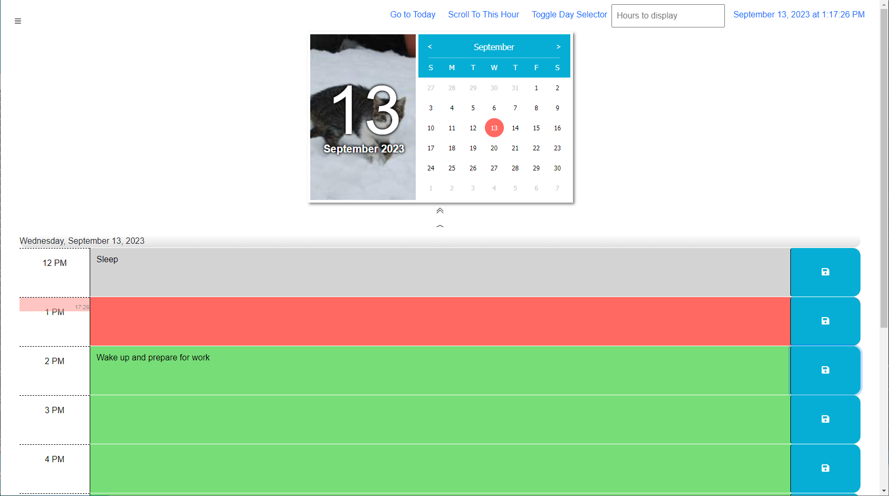

# Work Day Scheduler

## About

This simple daily planner is a time management tool. Users can enter text information into hourly time slots to plan their daily activites.

## Links

Git repository: [https://github.com/andrenrwn/dayplanner](https://github.com/andrenrwn/dayplanner)

Published url: [https://andrenrwn.github.io/dayplanner/](https://andrenrwn.github.io/dayplanner/)

## Features

- Managing information
  The Day Scheduler presents hourly time blocks into which users can enter text information.
  - Text information is saved to the user browser's local storage for later retrieval.
  - Clicking time blocks allows editing text for that time block.
  Modifying the text in that time block triggers a blinking save icon.
  - Clicking on the "Save" icon button for that time block saves the data in local storage, and the save icon will stop blinking.
  - Refreshing the window loads the stored text for each timeblock from local storage and redisplays them.
  - The number of time blocks to display can be specified with the datalist in the navbar (between 3 - 24 hours)

- Clock/calendar
  The current day and/or time is displayed:
  - at the top of the web page in the navigation bar
  - on the left of the calendar day selector
  - right above the first time slot of the day

- Navigation
  - Scrolling down shows rows of time blocks up to the specified number of hours.
  - Clicking the up/down buttons will skip an hour or a day into the previous/future time blocks.
  - A day selector can be used to select a specific date
  - The day selector and navigation bar can be collapsed
  - Clicking on "Go to Today" will revert the selected day back to the current day.

- Color codes
  Time blocks shows past, current hour, and future blocks in different colors.  Grey = past, Orange = current, Green = future.

## Compoments & Credits

[jQuery](https://jquery.com/)

[Bootstrap](https://getbootstrap.com/) - UI, formatting and navbar

[jsCalendar](https://gramthanos.github.io/jsCalendar/docs.html) - Date selector

[Calendar image](https://placekitten.com/) - calendar image from placekitten.com

[Day.js](https://day.js.org/) - Day.js Javascript date/time API